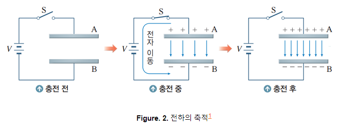
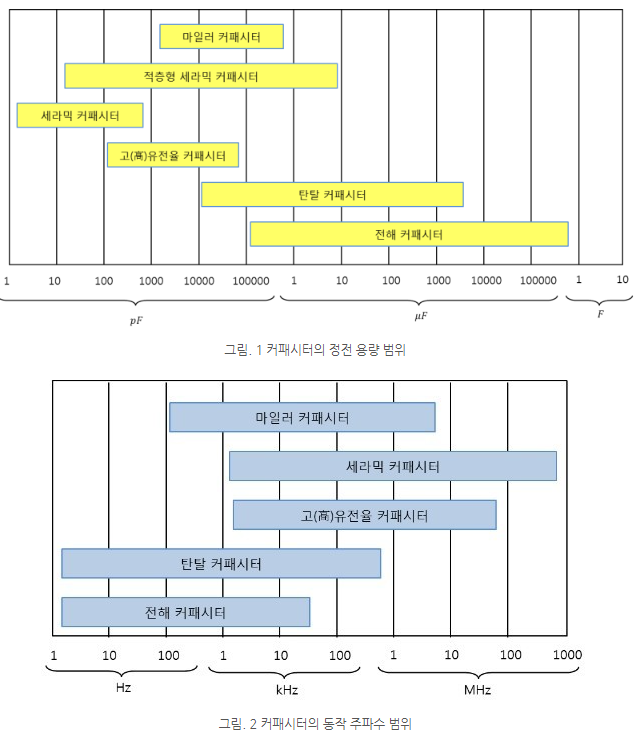

### __커패시터(축적기,커패시턴스) [참고자료](https://javalab.org/breadboard_capacitor/)
> : 전기를 에너지로 축적(저장)시키는 장치 
> : 아날로그전자회로/디지털전자회로에 필요한 에너지 스토리지 장치 
> : 내부 전기장에 에너지를 저장하는 전자기기 
> : 전하를 축적하여 에너지를 저장하는 소자 
> : 필요로하는 저항의 양이클때, 그 전하를 저장하는 장치 

1. 고정커패시터
> : 디지털 IC 공급전원 안정화 
> : 고전력 순간사용 시 전력량 보조 공급의 목적 
> : 저항, 인덕터오 조합한 특정 주파수 필터 목적 
> : 전원 승/강압 회로의 전하 추언의 목적
2. 가변커패시터(가변저항과 유서한 모양을 가짐) 
> : 아날로그 무선 통신 시 최종 출력단 주파수 조정 목적 
3. 그 외
> : 역률을 방지하기 위해 달아놓는다 
> : 신호를 차단하는일 및 노이즈해결 
  (직류:전기충전 후 차단),(교류: 전기충전 후 방전 그리고 다시 충전) 
> : 저항기와 인덕테와 함께 사용한다.  
> : 잡음제거회로, DC필터, 주파수 필터 등의 목적  

> 역률 -> 유호전력 중의 무효전력이 어느정도 차지하는가? 
> 전력 -> (유효전력:일을한다),(무효전력:일을하지 않는다.)

### 커패시터 읽는 법
> : 커패시터의 용량단위는 F(패럿), 기호는 C(커패시턴스)사용
> : 커패시터의 정전용량(전압)이 클수록 많은 양의 전하가 충전된다. 
1. 기본단위는 pF -> 100pF이하의 콘덴서의 용향은 숫자pF 
2. 내가 가지고 있는 커패시터는 35v이상 터짐.  
   1마이크로 -> 허용오차 1%
> 10 od 미리(m:-3), 마이크로(u:-6), 나노(n:-9), 피코(p:-12) 

### 커패시터의 전하의 축적 원리
### 

#### __커패시터의 종류__ : 커패시터 선정시 __주파수특성__과 __정전용량__을 고려하는 것이 [중요] 
### 

